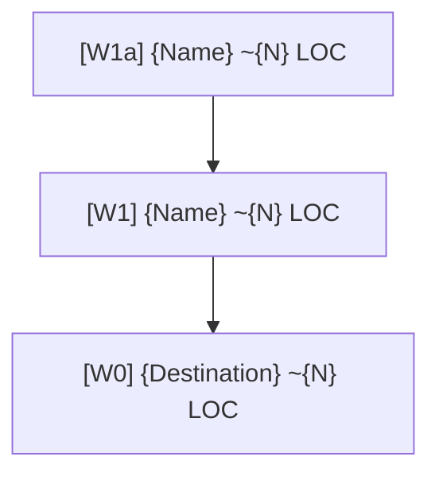
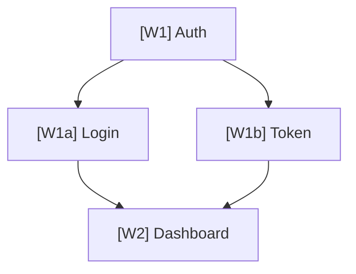

Given a destination, design and confirm a recursive Waypoint tree. Do not implement. The only deliverable is the confirmed Waypoint tree.

Plan to production standards: account for error handling, edge cases, security, performance, maintainability, external uncertainty, stack difficulty, and domain logic. Do not use toy-project estimates.

## Core Model

A Waypoint is a decision unit. `W0` is the destination. Every Waypoint is either:

- Intermediate: must be decomposed further; no LOC limit.
- Leaf: confirmed only when estimated size is `<= 1000 LOC`.

There is no decomposition depth limit. Keep decomposing until every leaf is `<= 1000 LOC`.

## Workflow

1. Estimate total W0 size before decomposition:

```text
W0 total estimate: ~{N} LOC
  -> Rationale: [1-2 lines based on similar projects or feature list]
```

2. For each decomposable Waypoint, propose candidates and let the user select.
3. Decompose the selected candidate into child Waypoints.
4. Repeat until every branch ends in confirmed leaves.
5. Output the final Mermaid tree, parallel execution graph, and execution order list together.

## Decomposition Candidate Format

Use 2 candidates for a clear yes/no split, 3 for strategy/technology/priority axes, and 4+ only for genuinely distinct paths.

```markdown
## [W-ID] Decomposition

> [One-line core question about how to split this Waypoint]

**Candidate A - [direction name]**

- Pros: [1 line]
- Risks: [1 line]

Waypoints:
  - [W-ID]-A1: [name] ~[N] LOC - [role, 1 line]
  - [W-ID]-A2: [name] ~[N] LOC - [role, 1 line]

**Candidate B - [direction name]**

- Pros: [1 line]
- Risks: [1 line]

Waypoints:
  - [W-ID]-B1: [name] ~[N] LOC - [role, 1 line]
  - [W-ID]-B2: [name] ~[N] LOC - [role, 1 line]

Recommendation: A / B - [reason, 1 line]
```

Candidates must differ by implementation direction, not just size splits.

## Final Output

After all Waypoints are confirmed, output all three sections.

### 1. Mermaid Tree



- Node: `[<ID>] {name} ~{N} LOC`
- Edges: dependency direction
- No styles or colors

### 2. Parallel Execution Graph

Show dependency relationships and parallelism for all Waypoints, including intermediate nodes.

- `A --> B`: B can start after A is complete.
- `A & B --> C`: C can start after both A and B are complete.
- Nodes with no dependencies in the same column can run in parallel.
- Isolated nodes with no arrows can start at any time.



### 3. Execution Order List

List tasks in dependency order for human readability. Each item includes one status:

- `TODO`: not yet started
- `DOING`: currently being worked on
- `REVIEW`: in pull request
- `DONE`: complete; skip when passing context to AI

```markdown
## Execution Order

1. [W-ID]: {name} (~{N} LOC) | [TODO]
   [scope, 1 line]

Total {N} items | Total estimated LOC: ~{N}
Sum check: leaf total {N} LOC vs W0 estimate {N} LOC -> deviation {N}%
```

## Final Checklist

- W0 total LOC was estimated first.
- Each leaf Waypoint is `<= 1000 LOC`.
- Leaf total is within `+/-20%` of the W0 estimate.
- Each Waypoint's LOC reflects technical difficulty and operating environment.
- Every Waypoint is separable as an independent PR unit.
- Decomposition candidates differ by implementation direction.
