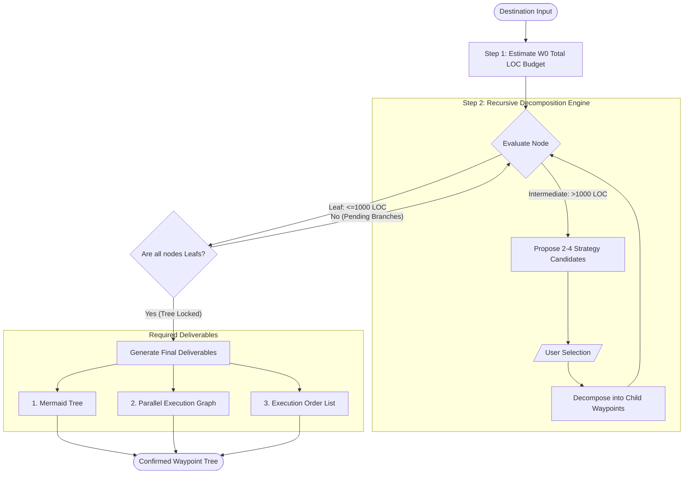
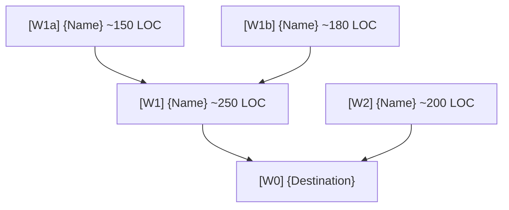
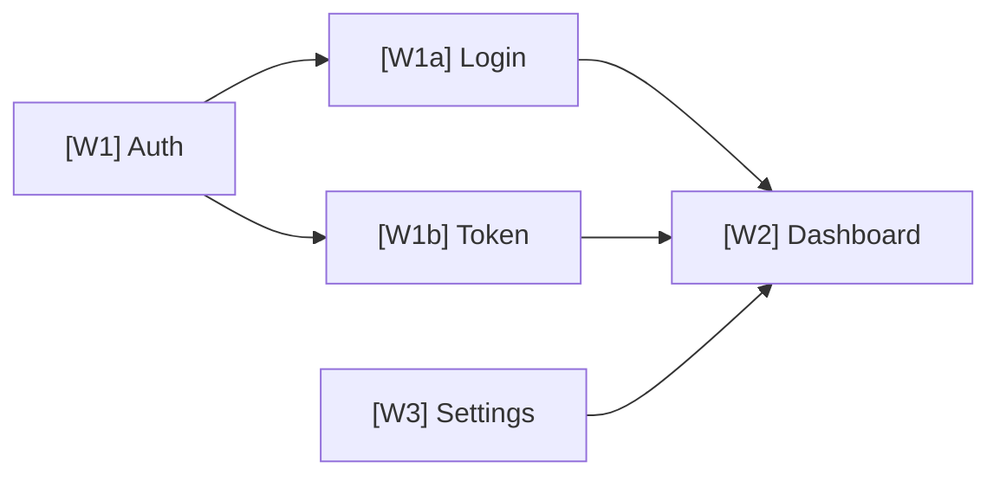

When given a destination, design a Waypoint tree and confirm it with the user.
**Do not implement.** The only deliverable is the confirmed Waypoint tree.

**Design to production standards.** Even without explicit instruction, account for error handling, edge cases, security, performance, and maintainability when sizing and scoping Waypoints. Do not make optimistic toy-project-level estimates.

## Core Model

A Waypoint is a **decision unit**. The destination itself is W0, and every Waypoint is evaluated for whether it can be decomposed further.

```
W0 (destination)
  → Decomposable? → Propose candidates A / B / C → User selects
  → Selected child Waypoints
      → Each decomposable? → Propose candidates → Select
      → ...
      → No further decomposition needed → Confirm
```

When judging whether to decompose, consider realistic complexity:
- Difficulty and learning curve of the tech stack
- Uncertainty from external APIs, browser APIs, etc.
- Depth of domain logic

**There is no limit on decomposition depth.** Going W0 → W1 → W1a → W1a-1 across as many levels as needed is correct behavior. Keep decomposing until the leaf condition is met.

## Workflow



## Code Budget

### Step 1 — Estimate W0 total size (required)

Upon receiving a destination, **before any decomposition**, estimate the total expected LOC.

```
W0 total estimate: ~{N} LOC
  → Rationale: [1–2 lines based on similar projects or feature list]
```

This number becomes the budget that governs overall planning and sizing.

### Step 2 — Decompose vs. confirm

Every Waypoint is either an **intermediate node (to be decomposed)** or a **confirmed leaf**.

**Intermediate node:** No LOC size limit. It will be decomposed in the next step, so any size is fine.

**Leaf confirmation criteria:** Stop decomposing only when the condition below is met.

| Condition | Threshold |
|-----------|-----------|
| **Absolute cap** | ≤ **1000 LOC** |

If the condition is exceeded, **decomposition is required**.

> **Example** (W0 ~10,000 LOC project)
> - W1: ~3,000 LOC → intermediate node, must decompose ✓ (size irrelevant)
> - W1-A: ~1,800 LOC → intermediate node, must decompose ✓
> - W1-A1: ~700 LOC → leaf confirmed (≤ 1000 LOC ✓)
> - W1-A2: ~1,100 LOC → still too large, must decompose again ✗
> - W1-A2a: ~500 LOC → leaf confirmed (2nd-level decomposition result) ✓
> - W1-A2b: ~600 LOC → leaf confirmed (2nd-level decomposition result) ✓
> - W1-B: ~900 LOC → leaf confirmed directly at the first decomposition level ✓
>
> This shows the expected behavior:
> - Some children become leaves immediately.
> - Some children remain intermediate nodes and require another decomposition pass.
> - Decomposition continues until every leaf is ≤ 1000 LOC.

## Decomposition Candidate Format

```
## [W-ID] Decomposition

> [One-line core question about how to split this Waypoint]

**Candidate A — [direction name]**

- Pros: [1 line]
- Risks: [1 line]

Waypoints:
  - [W-ID]-A1: [name] ~[N] LOC — [role, 1 line]
  - [W-ID]-A2: [name] ~[N] LOC — [role, 1 line]

**Candidate B — [direction name]**

- Pros: [1 line]
- Risks: [1 line]

Waypoints:
  - [W-ID]-B1: [name] ~[N] LOC — [role, 1 line]
  - [W-ID]-B2: [name] ~[N] LOC — [role, 1 line]
  - [W-ID]-B3: [name] ~[N] LOC — [role, 1 line]

Recommendation: A / B — [reason, 1 line]
```

Number of candidates:
- 2: when the direction is a clear Yes/No split (default)
- 3: when strategy, technology, or priority axes differ
- 4+: when there are genuinely many distinct paths

## Final Output Format

After all Waypoints are confirmed, output all three together.

### 1. Mermaid Tree



- Node: `[<ID>].{name} ~{N} LOC`
- Edges: dependency direction
- No styles or colors

### 2. Parallel Execution Graph

Shows the **dependency relationships** and **parallelism** of all Waypoints.

Rules:
- `A --> B`: B can start after A is complete
- `A & B --> C`: C can start after both A and B are complete
- Nodes with no dependencies placed in the same column → can run in parallel
- **Include all nodes (intermediate nodes included)** — omitting intermediate nodes makes dependency relationships inaccurate



- Nodes in the same column = can start simultaneously
- Isolated nodes with no arrows = can start at any time

### 3. Execution Order List

Lists tasks in dependency order for human readability. Each item includes a status.

**Status definitions:**
- `TODO` — not yet started
- `DOING` — currently being worked on
- `REVIEW` - in Pull Request
- `DONE` — complete (skipped when passing context to AI)

```
## Execution Order

1. [W-ID]: {name} (~{N} LOC) | [TODO]
   [scope, 1 line]

2. [W-ID]: {name} (~{N} LOC) | [DOING]
   [scope, 1 line]

3. [W-ID]: {name} (~{N} LOC) | [DONE]
   [scope, 1 line]

...

Total {N} items | Total estimated LOC: ~{N}
Sum check: leaf total {N} LOC vs W0 estimate {N} LOC → deviation {N}%
```


## Checklist

Verify before finalizing the Waypoint tree.

- [ ] Was W0 total LOC estimated first?
- [ ] Is each leaf Waypoint ≤ 1000 LOC?
- [ ] Is the leaf sum within ±20% of the W0 estimate?
- [ ] Does each Waypoint's LOC reflect technical difficulty and operational environment?
- [ ] Is every Waypoint separable as an independent PR unit?
- [ ] Do decomposition candidates reflect differences in implementation direction, not just size splits?
